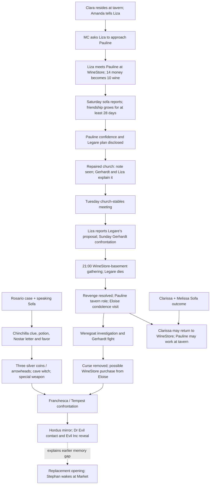

# Legare revenge, Tempest reveal, and replacement opening

Design plan from the 2026-09-28 03:45 user outline and subsequent clarifications. **This is a plan, not a claim that the sequence is playable.** Preserve existing QSP/TXT dialogue where it applies; new Russian scenes need their own authored text and illustrations. All participants in intimate scenes are adults. The event label owns its picture, text, choices, and completion; a room owns only entry, navigation, and objects.

## Confirmed decisions and live baseline

- The Market awakening **replaces the current opening**; it is not a second playable opening or a mid-game teleport. The later Tempest/Evil Inc arc explains the memory gap. A new game begins with the aftermath; existing saves are not replayed through it.
- Liza's first Pauline meeting includes a **real WineStore purchase**: spend 14 maravedy and add 10 wine to tavern stock, using the WineStore's one-barrel rule. Insufficient funds must not silently create wine or debit money.
- Liza gives her Saturday reports **on the installed burgundy sofa**, in a deliberately provocative seated pose, in the renovated guest room before the tavern opens. The new planned illustration is `game/images/Liza/lizaNew/liza_pauline_saturday_report_sofa.png`; the separate WineStore meeting illustration is `game/images/Liza/lizaNew/liza_pauline_wine_store.png`. These assets are present but are **not yet bound to events**.
- Pauline is an **adult** pupil of Eloise's finishing school, not Legare's daughter (`legare_household.md`). The existing seller schedule places her in WineStore while Clarissa resides at the tavern. The WineStore is open Monday–Saturday 06:00–17:00, except Friday closes at 15:00 (`WineStore.rpy`). Tavern service begins at noon.
- Live `claraLegareRevenge` has stage 0 Amanda/Liza talk and stage 1 the MC's direct request. Stage 2 is an intentionally disabled old WineStore fight, **not** the Pauline route. No later beat below is implemented merely because its thread has a name.
- `Sofa.installed`, `tavern.renovation_complete('guest_room')`, the Player economy, and WineStore stock are existing authorities. `Clara.tavern_resident()` currently derives residence from completed Clara threads; it cannot represent her later return to the shop without a deliberate owner change.

## Event dependency map

The dotted edge is a **narrative explanation**, not an executable jump that restarts the game. The Clara/Melissa Sofa outcome is a separate existing story line and must not be advanced merely by completing revenge.

## Event plan and exact gates

`R` identifiers are design IDs, **not new save flags**. Each row advances one ordered revenge-thread stage only after its outcome has actually happened; repeatable Saturday reports leave the cursor in place until the month is complete. Use the actual game clock, not the descriptive `day`/`evening` UI term.

| ID | Trigger / owner | Required conditions | Outcome / image |
| --- | --- | --- | --- |
| R0 | Existing `claraLegareRevenge` stage 0, Tavern Hall entry | Existing Clara resolution and Amanda/Liza presence gates | Amanda tells Liza about Legare; existing text remains. |
| R1 | Existing Liza talk option, stage 1 | Clara living at tavern; Liza on tavern team and present; existing Liza relationship gate (currently `rel >= 5`); stage 0 complete | MC entrusts Liza with befriending Pauline. Preserve the approved direct exchange. |
| R2 | WineStore **entry** event, stage 2 | R1 complete; shop actually open; Pauline is the seller; Liza is projected there, awake and available; player has at least 14 maravedy; at least the next game day after R1 | Liza speaks with Pauline and buys one barrel. Debit 14, add 10 stock **once**, show `liza_pauline_wine_store.png`, record first meeting day on the Liza owner, then advance. No automatic fight. |
| R3 | Guest-room **entry** event, repeat while stage 3 | Saturday 09:00–11:59; R2 complete and at least one later day; tavern not yet open; guest-room renovation complete; `Sofa.installed`; Liza projected in guest room and not sidelined by sickness/work | Liza sits on sofa and reports in `liza_pauline_saturday_report_sofa.png`. Once per Saturday, not once per re-entry. Report content changes with elapsed Saturdays, but relationship and thread advancement do not multiply on re-entry. |
| R4 | Last qualifying R3 report | At least **28 game days since R2**, and the Saturday report is actually seen | Liza says she and Pauline are now close; she discloses Pauline's account of Eloise/Legare's private training request. Advance to the church part. The exact Russian speech is to be authored, not inferred from a flag. |
| R5 | Church observation event | R4 complete; **church repair complete**; service/visitor access; Pauline and the young messenger present; player visits the church | MC observes a discreet note handoff. One-time scene; no omniscient reveal of its contents yet. The exact definition of *repair complete* is missing from live code and must be chosen before implementation. |
| R6 | Gerhardt/Liza conversation, church | R5 seen; both available at their actual church schedule; no concurrent confession/service event | They explain that Liza suggested the note and that it arranges a **Tuesday late-evening** meeting at the church stables. The specific hour range must be fixed before coding. |
| R7 | Church-stables observation | R6 complete; the **next eligible Tuesday late evening**; church-stables access; participants present | Observe the rendezvous, then advance. A missed Tuesday rolls to the next one; it does not abort the thread. |
| R8 | Guest-room Liza/Legare report | R7 complete; both characters available, guest room available, and a legitimate reason for Legare to enter despite the existing tavern ban | Liza reports Legare's proposed **5,000-maravedy** payment, intended for Pauline via Liza on a **50/50 split**. The ban/visit conflict is unresolved; do not bypass the ban silently or auto-charge the player. |
| R9 | Sunday church exterior / walk-around event | R8 complete; **next eligible Sunday**; church repair complete; Gerhardt and Legare present | Gerhardt confronts Legare about his plan and demands **50,000 maravedy** for his silence; tells him to wait in his own basement. This amount is narrative until the payer and owner of the funds are implemented. |
| R10 | WineStore-basement event | R9 complete; one of the **next couple of days at 21:00**; basement access; Gerhardt, Pauline, Melissa, Legare and the other required participants are at that location | The masked, wine-fuelled gathering ends with Legare suffering a fatal attack. Event controls its own sequence/pictures and moves the story to aftermath. Exact day offset, scene staging, and participant consent/availability need authorship. |
| R11 | Aftermath event | R10 completed, Legare's death recorded once | Mark revenge complete; Gerhardt is in possession of Legare's money as stated in the outline. The player's balance is unchanged unless a separate award is expressly defined. Pauline becomes eligible for a tavern-team role; no automatic duplicate NPC. |
| R12 | Legare-house condolence visit | R11 complete; Eloise at home; player has access | MC offers condolences and recovers the mentioned private object if it has previously been established. One-time outcome; object catalog, ownership, and choice text still need definition. |

Schedule projections for R2/R3 must come from the **current revenge-thread stage**, not an extra `liza_meeting`/`report_ready` boolean. Sick/busy NPC schedules outrank these story visits. A report missed because the player did not enter the guest room waits for the next Saturday. A save that already completed the old three-stage revenge thread must **not** be reset without an explicit migration decision.

## Consequences and later threads

| ID | Trigger and required state | Result / unresolved specification |
| --- | --- | --- |
| A1 | R11 complete; Pauline agrees to join; a valid tavern job/room schedule exists | Pauline becomes a tavern worker with guest-room and glory-hole assignments through the existing tavern scheduler. Define her decision and hiring interaction before giving her those assignments. WineStore needs a real seller transition. |
| A2 | Clarissa/Melissa Sofa thread actually reaches its relationship outcome; Clarissa chooses to return to WineStore | Change **one authoritative Clara residence state**. Do not unset `claraPaintingsPath.completed` or maintain a second `is_resident` mirror. Pauline's shop schedule follows the same residence transition. Clarissa's later tavern visits remain possible. |
| A3 | R11 complete plus existing bats/noise/roof clues and relevant Gerhardt discovery | Open the Gerhardt-as-weregoat investigation and fight. The existing moon/noise thread is a prerequisite source; revenge alone must not instant-win the fight. The medallion clue **“Quod me nutrit me destruit”** and boss-only removal victory are specified in `forest_sabbats_weregoat_tempest_notes.md`; health depletion alone never completes A3. |
| A4 | A3 fight won; the curse affecting the city's virgins is demonstrably removed; Eloise is willing to sell | Offer purchase of the WineStore from Eloise. Price, legal transfer, and wine inventory ownership are **unspecified**; no free store transfer. |
| A5 | A4 complete and the cave relic **Дилдон Ебунец** acquired | Reveal Franchesca as Tempest. The ancient magical, intelligent relic provides a way to challenge her and pursue escape from this world; possession alone does not automatically win the confrontation. Her current temple NPC/talk state must not be overwritten by a parallel villain object. |

The Sofa/witch supply line is a distinct ordered quest, not hidden state in the revenge thread:

| ID | Trigger and required state | Result / unresolved specification |
| --- | --- | --- |
| S0 | Nostar/Rosario puzzle solved and `Sofa.installed`; the Sofa has told its curse story | Ask the Sofa about its former owner. It recounts Nostar's private gatherings and tincture, identifies the green-house tiefling's motive (her own chinchilla died after bad food), and teaches the recipe. It does not put ingredients in inventory. |
| S1 | `nostarRosarioSofa` complete; a day has passed since the Sofa taught the recipe | `nostarRosarioFavor` delivers Nostar's letter in the main hall. At Nostar's house, over 12 exploration levels (`player.stats.exploration >= 1300`, 100 points per level) allow MC to take ten individual pellets unnoticed from Rosario's cage. The event offers a leave choice; it advances only when the pellets are taken. |
| S2 | S0/S1 and ingredients acquired through existing item rules | The recipe book offers one Rosario tincture for one pellet, one honeycomb, one bottle of spirit, and one rare mushroom; crafting takes 45 minutes. Sharing it raises immediate arousal and grants the rare-mushroom fertility effect for two days, without a permanent corruption change. |
| S3 | S1 completed; five pellets remain in inventory; MC visits the green house in the nobility quarter | Confront the tiefling, negotiate her apology and an end to stealing Rosario, then exchange five pellets for three `silver_coin_001` items. Report the settlement to Nostar to complete `nostarRosarioFavor`. The recipe book then reveals a cast: three coins and one chopped log produce three `silver_arrow_tip_001` items in 90 minutes. These are separate tips, not usable arrows; mounting them and the cave fight remain pending. |
| S3a | Sherwood bandit camp actually cleared; Becky's route to Cunidail/Куниделл is open for trade | MC can continue business with the Cunidail elves. In gratitude for removing the bandits, they disclose a cave and tell MC that the ancient magical, intelligent relic **Дилдон Ебунец** is hidden there. This clue belongs to an elf encounter after the road-clearing outcome, not to a generic first visit or merely to an offered trade deal. Exact dialogue, elf speaker and cave directions are not yet authored. |
| S4 | S3a revealed the cave; the cave can be reached; the separate silver-tip/witch preparations required by the eventual fight are ready | Resolve the cave-witch obstacle and recover **Дилдон Ебунец**. Whether the witch guards the relic, it is hidden beyond her, or it is battle loot is still unspecified; cave access, combat stats, relic item/NPC behavior, and illustrations are pending. The relic is the planned aid against Franchesca/Tempest and a possible route toward escape, not an automatic victory or exit. |
| S5 | A5 won; Hordus available on his market schedule; mirror purchased at a defined price | Use the mirror to contact Dr Evil; reveal the Evil Inc apartment connection. The mirror needs one inventory/object owner and a real Hordus catalog entry. |

## Replacement opening: playable order and memory reveal

The **new-game-only** prologue begins with Stephan waking at the Market in unfamiliar Coitus-town surroundings, in a medical robe, safety glasses and rubber gloves, carrying a vibranium ring/communications unit. This is the immediate aftermath of a Tempest conflict that the player cannot yet remember. The Blind Pirate workers witness their employer being sent to slavery nearby. Sandra finds Stephan and says he has been missing **three weeks**; she asks about his clothes on their way home and describes the ruined tavern, rats, bats and dirt. In his room, the communication unit barely reaches Dr Evil, who promises to find a way out and says something went wrong in the Tempest fight; Penny is introduced in this opening arc. On the table is Duchess Conchitta's letter explaining Stephan's inheritance. At the tavern Amanda and Melissa object to his absence; reading the letter returns fragments of a memory that is *not his own*, including his uncle expelling him and his sailor years. This hands off to normal tavern play.

The late Franchesca/mirror arc reveals **why** those opening images and the memory gap occurred. It must not jump back to `Intro` or reset the calendar, inventory, relationships, completed threads, or saves. The live `Intro.rpy` still contains the old inheritance opening and jumps into tavern play; replacing it is **not implemented** by this plan. The exact identity/memory mechanism, Penny's first scene, and whether the three missing weeks count in the game's day counter remain design decisions. Do not invent them while coding the opener.

## Implementation boundaries and acceptance checks

1. Replace the stage-2 disabled fight only when R2 has its own event, schedule, art, purchase accounting and save test. Extend the same `claraLegareRevenge` cursor for R3–R11. The old fight may be removed or reassigned only after its story role is settled; it is not a substitute for the Pauline route.
2. Use `WineStore`/Player economy for the 14-maravedy, +10-wine transaction; use Liza's existing NPC state only for the meeting date if it must persist. No shadow tavern-stock counter.
3. Keep the guest room's navigation intact. On R3 entry, the **event** shows only the sofa scene and native continuation; the room menu appears after it returns. Do not show the peephole overlay on a direct guest-room scene.
4. Reconcile the **Legare tavern ban versus R8 guest-room visit**, the **church-repair completion gate**, the **Clara/Pauline WineStore handover**, and the **R10 location/time** before implementing those events. These are explicit blockers, not invitations to guess.
5. Verify poor-player R2, interrupted/sick Liza, missed Saturday, repeated guest-room entry, 28-day transition, repaired/unrepaired church, missed Tuesday/Sunday, save at old stage 2, save with old thread complete, and no unintended pregnancy/relationship/stock change from observation-only events.

No remote synchronization or gameplay completion is implied by this document. Each implemented slice should be validated and committed separately with its exact status recorded here.
