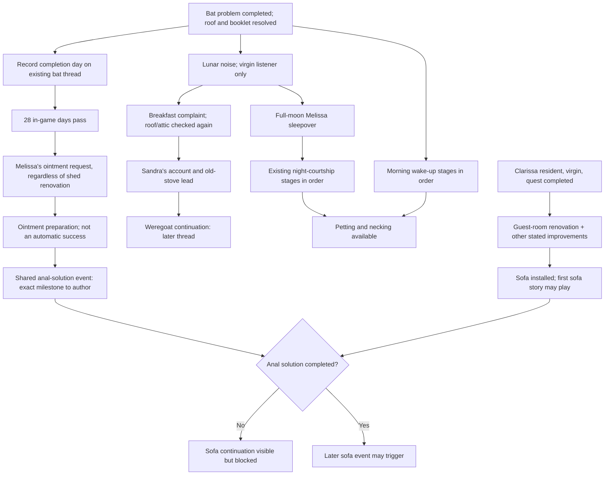

# Melissa, Clarissa, the lunar noise, and the sofa — event/thread plan

Status: **implemented through the ordered investigation, wake-up, ointment and solution milestones; the weregoat continuation remains unwritten** (2026-09-28). This records the requested story order and the remaining live-code gaps. It does not replace authored TXT/QSP dialogue or authorize changes to adjacent, working scenes.

## Source of truth and scope

- The 28-day moon month, absolute day, hour, and phase belong to `calendar_v2` (`game/script.rpy`, `game/Utilities/Time/NextDay.rpy`). There is no second lunar counter. The current phase implementation reports Full Moon on moon-month days **17–20**; the proposed noise window is days **14–23 of that same moon month** (three days before, four full-moon days, three days after). It drifts against weekdays and repeats in each moon month. The unused eighth named phase in the current 28-day/eight-four-day-phase mapping is an existing calendar inconsistency, not a reason to create another calendar here.
- `melissaBatProblem`, `melissaCourtship`, `melissaOintmentIntimacy`, `claraPaintingsPath`, and `claraForestSofa` are the existing story owners. `Melissa` and `Clara` own their own virginity, condition, relationship and clothing state. `tavern.renovations` owns construction; `Sofa` owns installation; the player inventory owns the cream. Do not mirror any of these in a room or screen.
- An event definition owns prerequisites, hour/location/action, priority, repeatability and delay. Its authored label owns picture, text, native `menu:`, consequences, and advance/complete/abort. Rooms expose entry/actions and navigation only. The morning household issue remains the authority for *sick* versus *sleepy*; it is not a second intimacy-stage counter.
- Melissa is an adult in the live character definition. This is story planning for the current Ren'Py project, not an instruction to import legacy family relationships or wording from QSP.

## Dependency map

This is an **ordering diagram**, not a claim that all nodes exist in live code. Morning wake-ups and night visits are two routes of character development, not two counters for the same event. Neither may jump the other to a later sexual option.

## Event sequence and authored beats

| Step | Trigger / place | Story beat and consequence | State rule |
| --- | --- | --- | --- |
| B0 — old bat conclusion | Existing `story_melissa_bat_problem_6` | Melissa thanks MC; bat/roof/booklet quest closes. Preserve its text and scene. | Complete `melissaBatProblem`; stamp its existing `ThreadInfo.day` at completion for the later 28-day delay. Do not revive the retired `bats_completion_day` mirror. |
| L0 — recurring noise | Moon-month days 14–23, late night; after bat/roof resolution | The old bat explanation no longer fits. A virgin listener hears the returning noise; a non-virgin does not. Start from an upstairs/bedroom observation, not MC's room. | Separate repeatable lunar event, once per eligible moon/day as appropriate. Check each NPC's live `sex_stat("virginity", True)` at play time. |
| L1 — complaint | Next applicable breakfast while noise persists | Melissa complains. Resident Clarissa also complains if *she* still hears it. If both qualify, use one breakfast episode with both voices, not duplicate scenes. | One-time discovery event for the first recurrence; later cycles may use short repeatable variations. Do not consume the ordinary breakfast or sickness events early. |
| L2 — recheck | Attic/roof investigation after L1 | MC checks the repaired roof/attic again and finds no bats; the supernatural question remains open. | This must not reopen or rewind `melissaBatProblem`, destroy the roof renovation, or claim a new bat infestation. |
| L3 — Sandra account | A subsequent breakfast after L2 | Sandra tells the village account about the weregoat, the priest's abuse of authority in her past, and the belief involving the old stove. Amanda's response depends on what she can hear/knows. Preserve the requested rough, comic tone when dialogue is authored; do not fabricate a milder replacement in this document. | One-time story event. Its conclusion enables the later shed/weregoat pursuit; it does not resolve the noise. |
| L4 — old-stove lead | Old shed stove, full moon, after L3 | The ruined-stove chamber becomes the next place to investigate, leading into the weregoat/satyr story. | The proposed hidden-MC/spirit-impersonation encounter is recorded as a separate, **unwritten** branch. Agency/consent for an intimate scene there is unresolved; no code, payoff or automatic progression is specified here. |
| O0 — delayed request | At least 28 absolute game days after B0; shed renovation does not matter | Melissa asks for the special ointment for its healing and skin-care qualities, and because she wants MC's attention. Existing Amanda/Liza ointment gossip remains an alternate introduction, but is not the sole prerequisite. | Both introductions feed the **same** `melissaOintmentIntimacy` progression. The delayed route does not require `amandaStreetDiscipline` or completed Melissa courtship. A refusal leaves the request available later. |
| N0 — first sleepover | Full-moon phase, bedtime in MC's room, after the bat/booklet safety gate and delayed-story readiness | Melissa asks to stay. The existing first-night masturbation observation remains intact. The original storm may supply scene atmosphere, but weather is not a substitute for the lunar gate. | Declining does not advance; accepting advances exactly once. Schedule uses actual hours and moon month, never a generic “night” text slot. |
| N1–N3 — further nights | Later eligible nights, minimum one day between stages | Preserve the current `melissaCourtship` gradual progression: mutual observation, her request to touch, and the later taste stage. Use its authored labels and illustrations unless an explicitly requested revision changes them. | Each stage advances only after its chosen interaction. No same-night cascade or repeat stat farming. |
| W0–W5 — morning wake-ups | Melissa remains in her room in an eligible morning before breakfast | See detailed wake-up table below. This is an incremental opportunity, not a one-click shortcut to the final action. | One stage per wake opportunity; same-day replay blocked. Declining leaves the current stage available for another morning. |
| P — intermediate intimacy | After the appropriate completed night/wake stages | Petting and necking become available, while later sofa-linked content stays locked. | Existing relationship/readiness methods remain authoritative. An exposed outfit or a high corruption score alone must not skip the story gates. |
| C — Clarissa continuation | Clarissa is resident; her existing quest/request and guest-room improvement are complete | Clarissa's own full-moon complaint joins the story if she remains a virgin. Her ointment and guest-room request remain separate existing scenes. | Her status is checked on her NPC object; no global “both virgins” flag. |
| S0 — sofa first story | Sofa installed, Clarissa's required improvements complete | The sofa's first conversation and curse story may play. The sofa thread is active/visible. | Do **not** trigger the final sofa ritual merely because both characters are present and virgins. |
| S1 — solution and later payoff | After a separately authored, completed anal-solution milestone | The later Melissa/Clarissa intimacy continuation can unlock, followed by the sofa payoff only at its own valid event. | The existing ointment attempt is **not** this milestone: its label ends when Melissa asks to stop before penetration. The later event and its exact completion criterion still require authoring. |

### Morning wake-up progression (requested order)

The persistent stage belongs to one Melissa wake-up **thread**, not to the household sick/sleepy flag or room-local counters. The existing household entry point offers the currently available story event; if it is not eligible, it retains the ordinary wake/care choices. Story event menus replace room navigation while active and return to the breakfast/room flow at the end.

| Stage | What the player sees and chooses | Picture authority | Advancement |
| --- | --- | --- | --- |
| W0 | Tickle; Melissa laughs and folds her legs up, exposing the view. She notices MC's bulge. | Melissa's sleep-cycle images already used by `HouseholdWakeSleepyGirl`; choose the matching frame rather than a static portrait. | The scene finishes, then W1 is available on a later morning. Do not immediately offer the handjob branch. |
| W1 | MC lets Melissa look. She can decline or stop without penalty. | Morning sleep/room frame. | Advance only if she chooses to look. |
| W2 | Melissa asks to touch. | A suitable existing Melissa image must be verified against the exact stage. | Advance on her own accepted request, not simply on MC entering the room. |
| W3 | She asks to hold it; her curiosity about MC is paired with allowing him a better look at her. | Morning/room frame, chosen for what it actually depicts. | One separate encounter. |
| W4 | She begins the handjob. | `images/melissa/sexyTimes/handjob_melissa.jpg` exists but is **not** currently in the Melissa image manifest; register it through `MelissaData` before use. The current wake-up label instead calls an `outfit_reward` image. | Use the existing sex/finish accounting once; no free repeat each morning. |
| W5 | On a later encounter she chooses the taste step. | Select and verify the matching picture from the existing `sexyTimes` sequence; do not use a thank-you portrait as a substitute. | Completion opens only the intended intermediate access, not the sofa finale. |

If Melissa is **sick**, she remains in her room and the thread does not reset or disappear. Her current condition changes how that day's encounter is presented; it does not secretly consume a stage or force an advance. The present generic room-action selector only offers care actions for `sick` and only offers `HouseholdWakeSleepyGirl` for `sleepy`, so this requires an explicit event-availability integration. Pregnancy/morning-sickness handling stays separate from ordinary illness and this wake-up thread.

## Locks, choices, and scheduling

- Bat problem completion, repaired roof, and returned/resolved booklet remain the safety/trust prerequisites for the night path. Ointment does not retroactively complete those scenes.
- Full-moon **sleepovers** are moon days 17–20, at actual bedtime hours; the **noise** is moon days 14–23. Do not use a weekday, absolute `daysInGame` range, or a second phase state. If virginity changes, the next evaluation stops that person's noise without rewinding scenes already seen.
- Clarissa must be resident/present for her complaint and joint scenes. If she is away, detained or absent, Melissa's own complaint still plays; there is no phantom Clara dialogue.
- Do not force illness, lust, friendship or a gifted item to equal consent or a completed story stage. “Not now” keeps the correct stage, consumes only the explicitly authored time, and does not secretly set a success flag.
- The special cream remains a real inventory item. Request, possessing the recipe, possessing cream, using cream, and succeeding at the later solution are distinct facts. The current `melissaOintmentIntimacy` completion means the existing attempt **stopped**, not that S1 succeeded.
- A completed shed before the 28-day threshold does **not** cancel Melissa's ointment request. This was explicitly decided during implementation; the request is about her own skin and attention, not the state of the bathroom.
- The existing sofa first-talk and ritual are two different stages in `claraForestSofa`. The future ritual gate needs the completed guest-room request/renovation and the actual solution milestone in addition to any unchanged prerequisites. Do not add a second `sofa_active` or `sofa_ready` boolean.

## Baseline discrepancies recorded before implementation

1. `game/Inn/HouseholdRuntimeEvents.rpy::HouseholdWakeSleepyGirl` currently gives the tickle, look and conditional handjob in one visit; no ordered W0–W5 thread exists. Sick Melissa only receives care actions.
2. `game/NPC/Girls/Melissa/MelissaEvents.rpy` already contains five `melissaCourtship` stages, but its first sleepover is a probabilistic storm event; subsequent nights are not locked to full-moon days.
3. `game/Utilities/General/Classes/StoryEventRuntime.rpy` currently gates `melissaOintmentIntimacy` on completed courtship and Amanda's street-discipline thread. There is no 28-day, no-shed route.
4. `game/Inn/TavernCursedSofa.rpy` currently allows the ritual after the existing forest/paintings, peephole, glory-hole, presence and virginity checks. It does not require completed guest-room renovation or a later anal-solution event, and it directly changes both virginity states. That is **not** the planned order.
5. A full-moon Clarissa forest event exists, but there is no shared post-roof Melissa/Clarissa lunar-noise complaint or weregoat thread. Do not reuse the forest event as an unrelated household dispatcher.
6. Current `MelissaData.image_manifest` maps `sexy_times` oral pictures but omits the dedicated handjob image, despite the file existing. Picture selection needs scene-by-scene visual confirmation before implementation.

## Implementation order and proof required later

1. Write focused timeline cases first: bat completion day +27/+28, moon days 13/14/16/17/20/21/23/24, full-moon recurrence next moon month, old-save bat completion, shed completed early, each person's virginity changing independently.
2. Put each new availability rule in the relevant existing event/thread definition. Use `melissaBatProblem.setDay()` at its completion only if the existing `ThreadInfo.day` has no other live reader depending on its earlier meaning; otherwise choose one timing field on the canonical thread/NPC owner, never a second completed flag.
3. Integrate the morning stages with the existing wake/sick action route. Preserve generic care and breakfast flow. Verify one event scene/picture/menu at a time and return to the correct room or breakfast menu.
4. Adjust the existing courtship and ointment stages **surgically**. Keep original text unless the new event specifically needs new dialogue; do not delete Amanda/Liza gossip or existing refusal outcomes just to make the timing work.
5. Add the lunar complaint/recheck/Sandra/stove story as ordered events. Record the unresolved stove-intimacy branch rather than implementing an invented resolution.
6. Add the shared solution event only after its condition and text are specified. Then change the sofa ritual gate without changing the sofa's object ownership, purchase flow, or first story.
7. Validate with focused source/runtime tests, Ren'Py 8.5.2 compile/lint, an old-save load, a week crossing the moon-month boundary, and manual UI checks for no leaked room navigation, correct images, no repeated stat awards and no early sofa payoff.

## Implementation checkpoint — 2026-09-28

- The ruined-stove chamber is a real hidden room. Inspecting the shed reveals its exit; the old stove object lives inside. A save migration adds the room/exit and moves the object from old Shed saves. Renovation removes access to the demolished chamber.
- `melissaMoonNoise` owns the five ordered discovery events; `melissaMoonNoiseRepeat` owns later eligible nightly recurrence. The moon window uses `calendar_v2.day`, the virginity check uses the live NPC objects, and the breakfast/attic/stove scenes use native event labels. If renovation has already removed the old stove, the last step records that lead as lost rather than presenting an impossible room.
- Bat completion stamps the existing thread day. The 28-day ointment route is an alternative to the unchanged Amanda/Lizette gossip entry into the same thread. The lunar courtship opener is likewise an alternative to the existing Amanda talk, so that talk is no longer an accidental hard prerequisite.
- `melissaMorningWake` has six one-time ordered stages, available in her room while sleepy or sick; illness is not cleared by these stages. The old single-visit handjob shortcut is held until the new sequence completes. Its dedicated handjob image is in Melissa's manifest.
- `melissaAnalSolution` records Clarissa's direct advice and a later private decision by Melissa. The second event consumes a real cream item only on acceptance, records one encounter, and leaves both virginity states unchanged. The sofa's later ritual now requires this thread and the guest-room renovation in addition to its previous conditions.
- Ren'Py 8.5.2 compile and lint exited successfully. Five focused source-test modules passed (36 tests). A broader source-test batch reported 64 passes, 4 failures and 31 fixture errors; most failures are stale assertions against unrelated prior architecture, while the old wake-tickle string assertion specifically conflicts with the new ordered gate. The native Ren'Py label-entry smoke tests passed for 19 Melissa labels (plus two thread-instantiation cases), after updating the test harness to the current NPC/UI owners. These tests stop at the first native choice; they do **not** prove every branch outcome. No manual click-through or old-save load has yet been claimed.

Still unwritten: the later weregoat/satyr branch and any intimate old-stove encounter. The present L4 scene investigates the stove only. That future branch requires its own conditions and authored scene, not an automatic event from entering a hidden room.
