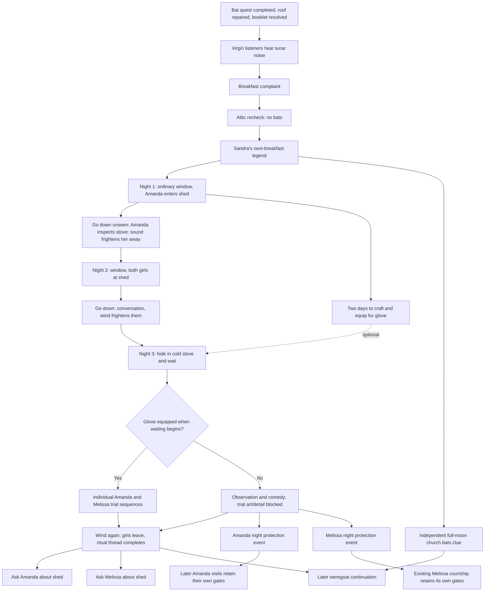

# Moon noise and Ollie's stove — scenario and event composition

Date: 2026-10-01. Audited baseline: `28f6c77`. Status: **scenario specification, not an implemented gameplay change**. This document records the current request, its complete event order, and the changes needed in the existing owners. Existing dialogue remains in its source files; the new investigation/comedy dialogue below is a draft. Detailed adult ritual prose is an authored-content slot, not newly generated prose in this document.

Review update: the user's supplied scene text replaces the corresponding draft verbatim, including its spelling and punctuation, rather than adding alternate versions. The clarified first shed scene has no conversation: MC stays unnoticed.

## Story contract

The repaired roof does not end the recurring lunar disturbance. Only NPCs whose live virginity state is true hear that disturbance. Melissa complains at breakfast; Amanda and resident Clarissa can join according to their own state. MC checks the attic and finds no renewed infestation. At a subsequent breakfast Sandra tells her existing village account, including the legend of Ollie in old stoves. That breakfast activates the shed continuation.

Distinguish that supernatural noise from real wind, footsteps and visible church bats. MC discovers the lunar disturbance through the women's complaints and sleeplessness; the opening must not make him hear the same virgin-only sound. Everyone in the shed can hear the ordinary gust through the cracked stonework.

The continuation has **three distinct nights**:

1. Through his ordinary backyard window, MC sees Amanda finish her usual nighttime outing but enter the shed instead of returning to bed. If he investigates, he stays unnoticed while she inspects the stove; a strange sound frightens her back to the tavern.
2. On the following night the same window reveals Amanda and Melissa at the shed. Investigating yields their conversation in front of the ruined stove, its existing conversation picture, and the wind frightening them away. No ritual trials play on this night.
3. On the third night MC can hide in the cold stove and wait. A fur glove is optional for entering this event. Equipped glove: the complete individual trial picture sequences can play. No glove: those pictures and their associated adult detail are omitted, but the ambush still resolves and unlocks Amanda's and Melissa's separate night protection visits. A renewed gust frightens the girls away and closes this part of the story.

Afterward MC can ask each participant about the shed through her own talk menu. The curse remains unresolved. Church bats at full moon are an independent clue toward the later weregoat story.

All characters in these current-day scenes are adults. The two women's individual scenes and night visits are separate. This arc does not change anyone's virginity or record a sexual encounter.

## Authority and current-code audit

| Subject | Current authoritative owner | Observed baseline | Planned delta |
| --- | --- | --- | --- |
| Lunar clock | `Calendar` in `game/script.rpy`, instance `calendar_v2` | Moon days 17–20 are Full Moon; the existing noise gates use days 14–23. | Reuse this calendar for eligibility and absolute-day delays. |
| Investigation | `melissaMoonNoise` in `StoryEventRuntime.rpy`; authored labels in `MelissaMoonNoise.rpy` | Five stages: noise, breakfast, attic, Sandra, compulsory old-stove entry. | Sandra completes the investigation and activates the window route. Keep ordinary stove inspection as an optional object action rather than a compulsory intervening story stage. |
| Shed continuation | Existing `melissaMoonStoveRitual` | Three stages: window clue, combined conversation/trials, joint bedroom visit. The ambush's event gate requires an owned and equipped glove. | Expand to the three-night order below. Remove the glove from event availability; use it only for the in-scene branch. Replace the joint bedroom follow-up with individual events. |
| Backyard window | `TavernMyRoomWindowLookBackyard` in `TavernMyRoomWindow001.rpy` | It already calls `checkTriggers("TavernMyRoom", "window_look", 0)` before normal window content. | Keep this entry point for both window clues. No automatic scene on ordinary MC-room entry. |
| Ruined chamber | `ShedRuinedChamber` and the shed's registered exit | A real hidden room revealed by shed inspection. Current `Shed.rpy` preserves the accessible chamber alongside a renovated shed. | Keep the actual room and its old cold stove. Do not substitute the working bathroom boiler, lounge hearth, or a nonexistent corridor-to-shed door. |
| Glove | `fur_glove_001` in `HunterClubItems.rpy`; player inventory/equipment | Wearable in `hand`. `PlayerCardMakeFurGlove` uses `warm_fur_cloak_001` or `fur_bedroll_001` and takes 20 minutes. | Make crafting available after the first window clue. Keep equipment ownership on the player. Record the route used when the ambush resolves. |
| Melissa night progression | `melissaCourtship`, `Melissa.intimacy_story_ready()`, and `MelissaEvents.rpy` | Existing bedtime progression has its own roof/booklet, delay and lunar gates. | Add a separate shelter/protection introduction; preserve later progression and its gates. |
| Amanda night progression | Amanda NPC state, registered Amanda events, and existing visit art | `amandaVisits` art exists. Live references found for remorse visits; a complete ordinary visit sequence was not found in the audited `.rpy` sources. | Plan an individual protection entry. Do not report the full older proposed visit series as already implemented. |
| Sleeping | `Sleep` in `Utilities/General/Common/Actions.rpy` | One `bedtime` event check, then `NextDay`. After-midnight sleep is allowed; `NextDay` already avoids a second calendar rollover. | Use distinct eligible bedtime windows. An unplayed visit stays pending. Do not assume two timed sleeping events will run automatically during one skipped night. |
| Church bats | Church entry event definitions and `Church` room | `fullMoonBatsEntry.png` exists, but no live `.rpy` reference was found. `batAttackNight.png` also exists. | Register a passive full-moon bats event. The attack image and combat are outside this request. |

**KEEP:** the window object action, real rooms and exits, stove object menu, native story labels, existing calendar/inventory/NPC owners, existing event tuples and linear threads.

**REMOVE/BYPASS in this arc:** the compulsory investigation detour before the window clue; the ambush's hard glove gate; the combined second/third-night scene; the joint protection visit. Do not add refresh labels, event wrapper classes, menu dispatchers, generic queues, or copied stage flags.

## Dependencies and timing

`D1` means the absolute game day on which the first window clue is actually observed. It is not a new counter. Use the existing thread's `day` marker and `calendar_v2.daysInGame`.

The exact clock ranges below are **proposed authoring values**; the user specified late nights and distinct visit times, not these minute boundaries.

| Encounter | Proposed time | Delay and lunar rule |
| --- | --- | --- |
| Initial noise | 21:00–23:59 | Moon day 14–23, after the original bat/roof resolution. |
| Complaint and Sandra | Existing breakfast slot 06:00–11:59 | Separate breakfasts; keep the existing one-day story delays. |
| First window clue | D1, 21:00–22:59 | Start on moon day 17 or 18, leaving enough nights for the sequence. |
| First shed check | D1, before 23:30 | Same night as the first clue. |
| Second window clue and conversation | D1+1, 21:00–23:29 | Minimum one absolute day since D1; first valid full-moon night after that delay. |
| Hide and wait | Next night after the conversation, 23:00–23:45 | Start on moon day 19 or 20 in the normal three-night run. Advance to midnight within the event. |
| Ambush resolution | About 00:00–00:25 | Midnight belongs to the same physical story night. If moon day changes to 21, do not cancel the already-running scene. |
| Amanda protection visit | Following eligible bedtime, 22:00–22:59 | No-glove outcome; noise-window days 14–23. Individual one-time event. |
| Melissa protection visit | Following eligible bedtime, 23:00–23:59 | No-glove outcome; noise-window days 14–23. Individual one-time event. |
| Church bats | 20:00–23:59 and 00:00–05:59 | Full Moon only. Two clock alternatives for one event, one common daily key. |

The glove can be made during D1 after the clue, throughout D1+1, and before the D1+2 ambush. No extra two-day craft timer is needed. The current craft itself takes 20 minutes.

Missing a night does not abort the story. Leave the current stage pending until its next eligible full-moon opportunity. If the first shed check is postponed, perform it on a later moon-day-17/18 night and restamp the thread day when that check finishes; the second night is then relative to that actual check. Likewise, a postponed second-night conversation restamps its actual date and must occur on moon day 18 or 19, leaving a valid subsequent ambush night. Thus an old date never makes a pending stage permanently unreachable, and a late observation never compresses the remaining stages into one night. No-glove protection visits also stay pending when an NPC is unavailable, MC sleeps outside her time window, or another event takes priority.

## Event registry and scene beats

Use the existing tuple order: `target, day, hour, delay, probability, reqs, conditions, item, location, action, priority`. Narrative stages have probability **1** when their conditions are met. Thread position selects the current stage; do not copy it into `NPC.var` or room state.

The expanded stove registry uses the following rows; `None` weekday means the calendar's weekday does not constrain this lunar arc. All rows have `probability=1`, `item=None` and proposed priority 30. The location/action fields must match the real caller exactly.

| Stage | Target | Location / action | Hour field | Delay | Additional event conditions |
| --- | --- | --- | --- | --- | --- |
| 0 | `story_melissa_moon_window_clue_0` | `TavernMyRoom / window_look` | `(21, 22)` | `None` | Moon day 17/18; Sandra heard; chamber accessible; available household participants; at least one virgin listener. |
| 1 | `story_melissa_moon_shed_check_1` | `Shed / enter` | `(21, 23)` | `None` | First valid moon-day-17/18 night after the clue; current minute before 23:30. |
| 2 | `story_melissa_moon_second_window_2` | `TavernMyRoom / window_look` | `(21, 22)` | `1` | Moon day 18/19; delay from actual first shed check. |
| 3 | `story_melissa_moon_shed_conversation_3` | `Shed / enter` | `(21, 23)` | `None` | Same valid story night as second clue, or next moon-day-18/19 catch-up night; before 23:30; both women actually available. |
| 4 | `story_melissa_moon_stove_wait_1` | `ShedRuinedChamber / stove_hide_wait` | `(23, 23)` | `1` | Moon day 19/20; minute ≤45; delay from actual conversation; old stove accessible and cold; glove optional. |

The real closure event for loss of both virgin listeners is an alternative at stage 4, with no glove/media requirement. It is a story outcome, not a refresh or handler label.

### Investigation — existing `melissaMoonNoise`

| Event label | Location/action | Pictures and text | Choices / progression |
| --- | --- | --- | --- |
| `story_melissa_moon_noise_0` | `TavernUpstairs / enter` | Existing upstairs frame. Correct the current line that makes MC directly hear the disturbance: he instead hears the women ask about it from their rooms. Add Amanda's contribution only if her live virginity is true; resident Clarissa uses her own state. | Existing observation choice; stamp day, advance. |
| `story_melissa_moon_breakfast_1` | `TavernKitchen / breakfast` | `tavern_kitchen_breakfast_picture()`; preserve the complaint, with one combined scene for the actual listeners. | Promise an attic recheck; advance. |
| `story_melissa_moon_roof_check_2` | `TavernAtic / enter` | `attic_room_picture_path()`; preserve the empty, repaired attic result. | Return with the finding; stamp day, advance. |
| `story_melissa_moon_sandra_story_3` | `TavernKitchen / breakfast` | Preserve the existing complete Sandra scene and its `Продолжить` choices. Amanda's response depends on virginity; non-virgin Amanda does not claim to hear the noise. | Finish Sandra's story; complete the shortened investigation. The stove thread becomes eligible. |

The original bat quest is already completed. Do not replay its roof repair, missing-booklet argument or thanks. MC's room is not an entry location for the initial noise discovery.

### Stove thread — expand existing `melissaMoonStoveRitual`

#### Stage 0 — first night, window clue

Label: keep `story_melissa_moon_window_clue_0`.

Trigger: `TavernMyRoom / window_look`; Sandra's story finished; old chamber accessible; Amanda and Melissa are available for the excursion, and at least one of them remains a virgin. Amanda's first reconnaissance does not require her to hear the noise herself: if non-virgin, she is checking the place for Melissa. Recheck those states in event conditions, since thread-wide prerequisites can be cached. The full two-person ritual requires both to remain virgins; a non-virgin companion has no personal trial.

1. `vscene "images/player_room/windowAmand.png"`
   Text: «Во дворе Аманда,.пописав,она встала , промакнула подолом ночнушки свой лобок, не пошла как обычно спать,а оглянувшись вокруг направилась к сараю.»
2. `vscene "images/tavern/backyard/shed/ghostEvent/amanda/amanda_enters_shed.png"`
   Text: «И шмыгнула во внутрь. Вас просто распирает от любопытсва, А не пойти ли и посмотреть?»
   Choices: `Да` → the next scene, first shed check; `Нет` → the ordinary MC-room menu.
3. Record D1 on the existing thread, advance to stage 1, expose the existing fur-crafting option. Both choices deliver the clue; `Нет` ends this window event and leaves the first shed check pending. Do not add another observation-choice menu before `Да` / `Нет`.

The descent follows the real route: `TavernMyRoom → TavernUpstairs → TavernMain → TavernKitchen → Backyard → Shed`. Use the existing movement authority and exit costs. No corridor opens directly into the shed. A chosen story transition remains under the event until it ends; its caller restores normal navigation afterward.

#### Stage 1 — first night, Amanda alone

Proposed event label: `story_melissa_moon_shed_check_1`.

Trigger: `Shed / enter`, normally the same eligible night after stage 0; a missed check remains pending for the next moon-day-17/18 night. The scene can continue into the real `ShedRuinedChamber` as an authored room transition.

1. Establishing frame: `images/tavern/backyard/shed/ruined_stove_chamber_night.png`.
   Text: «Вы потихонечку заглядываете во внутрь, Аманда внимательно изучает старинную печь и даже заглядывает во внутрь!»
2. Desired front-view frame: `images/tavern/backyard/shed/ghostEvent/amanda/amanda_stove_front.png` — **missing, not a loadable asset**. The prior generation failed. Do not silently substitute an inside-stove glove or trial image. Existing Amanda face close-ups can supply reaction frames, but do not depict this missing pose.
   MC's thought: «вот так история! подумали Вы, видать рассказ Сандры был воспринят чертовкой всерьёз».
3. Text: «Друг из-печи раздался странный звук, глухой полу-стон полу вой, преведший Аманду в ужас,
   Охнув она поспешно ретировалась и , пулей вылетев из сарайчика,поспешно ретировалась в трактир!
   Вы еле увернулись и чудом не были замечены.»
   This is an audible physical stove sound, not the virgin-only lunar disturbance. MC remains unseen; do not play the superseded conversation or invent a detection roll.
4. Choice: `пойду-ка я отсюда.` → leave the shed and restore ordinary tavern navigation.
5. Stamp the first check's actual day, then advance to stage 2. In the normal run this is still D1; after a missed check this is the new timing anchor for the remaining two nights. No trials, touch, intimacy rewards or new apology state are introduced by this reconnaissance.

#### Stage 2 — second night, window clue with both girls

Proposed event label: `story_melissa_moon_second_window_2`.

Trigger: the usual `TavernMyRoom / window_look`, at least one day after D1, during the next eligible full-moon night.

Picture: `images/tavern/backyard/shed/ghostEvent/window_clue.png`. This image actually depicts **both girls** outside the shed, so it belongs here rather than in the Amanda-only first clue.

Text: «Сегодня у сарая уже две белые сорочки. Аманда что-то объясняет, указывая на дверь; Мелисса слушает и поглядывает на окна. Потом обе скрываются внутри».

Choices: `Пойти проверить` / `Пока остаться у окна`. Advance to stage 3 once the clue is seen; the second shed check remains pending if MC stays behind. Do not restart the original window event or begin the ambush yet.

#### Stage 3 — second night, conversation and another gust

Proposed event label: `story_melissa_moon_shed_conversation_3`.

Trigger: `Shed / enter`, following stage 2 on that night. Author the encounter in the chamber in the existing event label. Both girls are present as established by the clue.

Use **only** `images/tavern/backyard/shed/ghostEvent/stove_conversation.png` for this whole event. Text changes and `Далее` choices stay on that image.

1. «Вы останавливаетесь за перегородкой. Аманда и Мелисса стоят перед разваленной печью и говорят вполголоса».
   Choice: `Послушать`.
2. User-supplied replacement dialogue:
   - Аманда: «Если Олли правда такой мохнатый, как Сандра говорит, зимой ему цены не будет».
   - Мелисса: «Ахаха эт же не кошечка какая в кровать тащить
     Сперва узнай, дома ли он. Свободен ли он, Вдруг ты с чужим домовым заигрываешь?)
     Или вдруг ты ему на ощупь не понравишься? ааа?»
   - Аманда: «Ой ой смотрите королева сранделей нашлась,хаха Посмотрим чья попка лучше хаха.»
   - Аманда: «Так,кароче не хочешь,так и скажи Мэл. Мне тож ссыкотно, но козел с снов надоел. Он на Херхарда похож.»
   - Меллисса: «не вместе пойдем. По очереди,есличто будем орать»
   - Мелисса: «Ну всё) договорились, панталоны снять не забудь только!»
   - Аманда: «Тише,ты корова.»
   - Мелисса: «Сама, корова»
   - Мелисса: «или попкой как вертеть будешь», ехидно говорит Мелисса.
   - Аманда: «не ссы ты»
   Choice: `Дослушать`.
3. «Сквозняк протискивается в трещину над топкой. Из каменного нутра выходит низкое, глухое „у-у-ум“. Обе разом перестают улыбаться».
   - Аманда: «Это ты?»
   - Мелисса: «Че совсем дура,вааще...блин!»
   - Аманда: «Тогда завтра. Сегодня он, кажется, занят».
4. «Они торопливо выбираются из каморки. Вы остаётесь у перегородки, пока их шаги не стихают во дворе. Теперь вы знаете и место, и время».
   Choice: `Вернуться в трактир и подготовиться к завтрашней ночи`.
5. Stamp the conversation's absolute day on the existing thread; advance to stage 4. This creates the one-day delay before hiding. No extra image or ritual occurs here.

#### Stage 4 — third night, hide and wait

Keep the existing event label `story_melissa_moon_stove_wait_1`; its legacy suffix does not require renaming a live label merely to match the new stage index.

Trigger: `ShedRuinedChamber / stove_hide_wait`, after the second-night conversation, minimum one day later, 23:00–23:45 on the valid lunar night. The old stove must be accessible and cold. **Neither glove possession nor glove equipment belongs in this event's availability condition.**

The real `ShedRuinedStove` object menu offers `Спрятаться в печи и ждать` when that event is available, and directly calls the existing `checkTriggers` for this action. This is an actual object action; do not create a label whose sole purpose is forwarding to the event.

1. `vscene "images/tavern/backyard/shed/ruined_stove_chamber_night.png"`.
   Text: «Вы пригибаетесь и забираетесь во внутрь печи. Под ладонью холодная кирпичная кладка. Из каморки вас не видно, зато отсюда слышен каждый шаг и хорошо видно окно в печь».
   Choices: `Затаиться до полуночи` / `Передумать и выбраться`.
2. With `fur_glove_001` owned but unequipped, offer `Надеть меховую перчатку и ждать`. Use player equipment's real `hand` slot. Merely owning the glove does not select its branch.
3. Leaving early keeps stage 4 pending and awards nothing. Waiting snapshots the route from current inventory/equipment. Advance time to the next midnight, exactly once, using `calendar_v2`; do not reset the date manually or invoke the daily report inside the encounter.
4. `vscene "images/tavern/backyard/shed/ghostEvent/stove_conversation.png"`.
   Text: «Дверь скрипит. Сегодня девушки говорят ещё тише, но шутить Аманда всё равно не перестаёт».
   - Аманда: «Ну, Олли, надеюсь, ты не пригласил сюда всех своих друзей извращенцев».
   - Мелисса: «И надеюсь, ты не собираешься знакомиться сразу со всеми его родственниками».
   Choice: `Остаться в укрытии`.

Two individual scene blocks follow in Amanda → Melissa order. They are authored beats in this real ambush event, with genuine scene sublabels only if that improves readability. They are not room actions, independent navigation screens, or handlers for one image.

### Third-night branches and picture order

| Branch | Scene sequence | Content and outcome |
| --- | --- | --- |
| Glove — Amanda | `amanda/amanda_stove.png` → `amanda/AmandaTrialF.png` → `amanda/amanda_fur_touch.png` → `amanda/amanda_surprised_closeup.png` → `amanda/amanda_laughing_stove_closeup.png` | Her individual ritual and reaction. Keep the existing source images as authored assets. The detailed adult passage is a separate supplied-text slot. Native `Далее` choices separate beats. |
| Glove — Melissa | `melissa/melissa_stove.png` → `melissa/MelissaTrialF.png` → `melissa/melissa_fur_touch.png` → `melissa/melissa_surprised_closeup.png` → `melissa/melissa_laughing_stove_closeup.png` | Her own turn and reaction, after Amanda's scene. Same authored-text rule. Do not imply that the two women are in the opening simultaneously. |
| No glove | `stove_conversation.png` → `amanda/amanda_surprised_closeup.png` → `melissa/melissa_surprised_closeup.png` → `ruined_stove_chamber_night.png` | Listening, failed expectation of Ollie, comic dialogue and retreat. No trial, fur-touch, raised-hem or corresponding detailed adult passage. The surprise here comes from the sound. |

In this table the first ten character paths are relative to `images/tavern/backyard/shed/ghostEvent/`. The chamber frame is under `images/tavern/backyard/shed/`.

The existing front-through-stove `amanda_stove.png` includes a glove in the foreground. It is therefore **not a neutral no-glove illustration**. Apply the branch check before selecting media or composing its text. `AmandaTrial.paint` is an editable source file, not a runtime `vscene` asset.

### Перчатка получена — отдельная ветка для комментариев

Это развёрнутый порядок уже запланированной ветки, а не новая стадия или дополнительный обработчик. Ниже можно комментировать каждый кадр отдельно. Подробный текст индивидуальных сцен остаётся для пользовательских правок; новых подробностей здесь не добавлено.

#### Выбор перед ожиданием

- Перчатка уже надета в слот `hand`: `Затаиться до полуночи` ведёт в ветку с перчаткой.
- Перчатка получена, но не надета: доступен выбор `Надеть меховую перчатку и ждать`; он надевает имеющийся предмет через существующего владельца экипировки и начинает ту же ветку.
- Полученная, но оставленная ненадетой перчатка: обычное ожидание ведёт в ветку **без перчатки**. Сам факт получения не выбирает кадры с перчаткой.
- `Передумать и выбраться`: сцена остаётся ожидающей, без результата и наград.

Ветка определяется в момент начала ожидания. Укрытие, переход к полуночи, вход девушек и их реплики описаны выше в stage 4; их не надо проигрывать второй раз.

#### Сначала Аманда

1. `vscene "images/tavern/backyard/shed/ghostEvent/amanda/amanda_stove.png"`
   Аманда подходит к печи первая, задирает подол ночнушки и сует попку во внутрь.
   - Ну ,Мелиска была не была.
   Кнопка: `Далее`.
2. `vscene "images/tavern/backyard/shed/ghostEvent/amanda/AmandaTrialF.png"`
   Перед вами открылись соблазнительные округлости. Аманда нетерпеливо шевелила орешками из стороны в сторону.
   Кнопка: `Далее`.
3. `vscene "images/tavern/backyard/shed/ghostEvent/amanda/amanda_fur_touch.png"`
   Вы осторожно протягиваете руку в перчатке и проводите Мехом по промежности Аманды. Она вздрагивает и тихо стонет.
   Кнопка: `Далее`.
4. `vscene "images/tavern/backyard/shed/ghostEvent/amanda/amanda_surprised_closeup.png"`
   От неожиданности Аманда взвизгивает и невольно сжимает промежность. Ой,вау щикотно и приятно...Хи хи... невольно вглядывается в темноту и расслабляет булки,что позволяет вам безопасно убрать руку. Слышен легкий смешок.  Вау,Мелиска...
   Кнопка: `Далее`.
5. `vscene "images/tavern/backyard/shed/ghostEvent/amanda/amanda_laughing_stove_closeup.png"`
   -Мелисса: Ну ты даешь! Че правда? потрогал? а ты меня не дуришь?
   Аманда одергивает подол и чепчет ,давай суй жопу пока не поздно,пока он не передумал...
   Кнопка: `Далее` → очередь Мелиссы, не меню комнаты.

#### Затем Мелисса

1. `vscene "images/tavern/backyard/shed/ghostEvent/melissa/melissa_stove.png"`
   Мелисса неуверенно подходит к печи, задирает подол ночнушки и ,изогнув изящно свою смуглую попку,суёт её во внутрь.
   Кнопка: `Далее`.
2. `vscene "images/tavern/backyard/shed/ghostEvent/melissa/MelissaTrialF.png"`
   Вы, выждав момент, нежно касаетесь ягодиц Мелиссы,и чувствуете как податливо они прижимаются к вам. Оухх ххх Ам.... Аххх! Вау вы,сжали одну из ягодиц и шлепнули легонько по её промежности. Ай ..хи хи
   Кнопка: `Далее`.
3. `vscene "images/tavern/backyard/shed/ghostEvent/melissa/melissa_fur_touch.png"`
  Немпого могладив и помяв слегка промежность вы решили,что этого достаточно и легонько шлёпнув по оттопыренным навстречу ягодицам,вы осторожно убираете руку. Мелисса тихо вздыхает и шепчет: "Ой,вау щикотно и приятно...аж горит всё ...".
   Кнопка: `Далее`.
4. `vscene "images/tavern/backyard/shed/ghostEvent/melissa/melissa_surprised_closeup.png"`
   Аманда похотливо улыбаясь, смотрит на расшриренные от изумления и приятных ощущений глаза Мелиссы. Она тихо шепчет: "Вау,ты даёшь! Че правда? потрогал? а ты меня не дуришь?"а!? я ж тебе говорила.
   Кнопка: `Далее`.
5. `vscene "images/tavern/backyard/shed/ghostEvent/melissa/melissa_laughing_stove_closeup.png"`
   Мелисса не обращая внимания на колькости товарки,признается Вау! кажется я кончила,аж коленки подогнулись такой пушистик ласковый... И итерично захохотала...
   Кнопка: `Далее` → общий финал ниже, не меню комнаты.

Каждая индивидуальная последовательность относится только к той участнице, которая ещё подходит для собственного испытания. Если другая присутствует лишь как спутница, её последовательность не запускается. Только после этих эпизодов следуют новый звук, бегство девушек и выход MC из укрытия. Результат `glove` и предусмотренные награды фиксируются один раз в общем финале. Эта ветка сама по себе не открывает новые защитные ночные визиты, предназначенные для исхода без перчатки.

### Общий финал обеих веток

End of both branches, from MC's hiding place:

«Пару минут удовлетворенного и похотливого хихиканья прервались, протяжным гулом с причмокиванием. Звучало низко гулко и зловеще в сарае пописла тишина...».

- Аманда: «Мош он тоже того, кончил?!»
- Мелисса: «Ну оннам об этом не скажет,но звучало пугающе... пошли отсюд поскорей а то у меня аж соски затвердели дубор такой»

«Дверь хлопает. Шаги и хихиканье поспешно удаляются через двор. Вы ещё немного сидите в печи, потом выбираетесь наружу. 
Ночная затея закончилась приятно и удачно,у вас дымится шишка,Перчатка покрыта липкой смазкой странно пахнущей смазкой.После ночной авантюры вам необходимо выспаться и отдохнуть,а завтра будет новый день.»;

Choice: `Выбраться из печи и вернуться в трактир`.

Record the actual route, attending NPC IDs and eligible ritual-participant IDs; apply end rewards once; stamp the final absolute day; finish the ritual thread. The wind does not identify MC, disclose the impersonation automatically, defeat the weregoat, or cure the nightmares.

## Glove preparation

Reuse `PlayerCardMakeFurGlove` and `fur_glove_001`. The valid donor IDs are `warm_fur_cloak_001` and `fur_bedroll_001`. The existing action says it cuts a small strip while leaving the donor usable; do not invent full-item consumption or a second recipe system.

The current visible crafting gate is `melissaMoonStoveRitual.num >= 1` with no existing glove. That remains appropriate after the first clue in the expanded sequence. Ordinary equipment controls remain available. The ambush can equip an already-owned glove through the player's existing equipment owner.

The described damage to the donor is presently text only; the craft does not visibly update a durability counter in the inspected label. Record this as a separate implementation check, not an excuse to rewrite the wardrobe system in this story task.

No material, no crafting, or an unequipped glove produces the no-glove route. This is a completed alternative outcome, not a blocked thread. Crafting the glove after resolution cannot replay the one-time ambush or retroactively switch its recorded route.

## Separate protection visits after the no-glove route

Proposed single-event linear threads: `amandaMoonProtection` and `melissaMoonProtection`. Each owns its own `done`, `num` and completion, registered in the existing event catalog. Remove the joint `story_melissa_moon_room_protection_2` from the ritual's trigger list; do not keep both joint and individual routes active.

| Label | Trigger and individual gates | Picture / text / choices | Completion |
| --- | --- | --- | --- |
| Proposed `story_amanda_moon_protection_0` | `TavernMyRoom / bedtime`, proposed 22:00–22:59; ritual completed with no glove; Amanda participated, remains virgin, is in the household and available; noise window active; her existing anger/ignore rules permit approaching MC. | Candidate arrival art: `images/player_room/amandaVisits/amanda_visit_0.jpg`, subject to scene review. «У двери мнётся Аманда. „Не смей смеяться. Домовой нас выставил, а наверху опять стучит. Я немного побуду здесь. Если усну — утром скажешь, что пришла проверить окна“». Choices: `Пустить её и выслушать` / `Проводить её обратно`. | Accept: complete her protection introduction only. Refuse: do not mark accepted or advance another thread; retry at a later valid opportunity. |
| Proposed `story_melissa_moon_protection_0` | `TavernMyRoom / bedtime`, proposed 23:00–23:59; same route, but Melissa's own participation, virginity, availability and existing `intimacy_story_ready()` checks. | Candidate arrival art: `images/player_room/batsProblem/melissa in the room.png`, already in her courtship manifest. «Позже Мелисса тихо стучит в дверь. „У тебя тоже слышно? Я думала, после печи станет легче. Можно сегодня побыть здесь? Только не рассказывай утром всем за столом“». Choices: `Пригласить Мелиссу` / `Проводить её в комнату`. | Accept: complete her introduction. Keep the existing courtship cursor and later intimacy gates intact. Refuse: accepted visit remains pending. |

These windows are disjoint. `Sleep` evaluates the event for the actual bedtime selected; it does not run an invisible overnight queue. One girl's visit must not mark the other's thread complete. If a visit is skipped because MC sleeps earlier, it remains available on a later eligible night. If the noise window ends, eligibility resumes in the next moon month.

Existing Amanda curiosity/erection/remorse sequences and Melissa's staged bedtime/morning progression retain their individual conditions. This ghost arc supplies a narrative cause for seeking company; it does not grant advanced sex options, clear an apology, bypass the original corruption gates, or turn food/drunkenness into permanent corruption. The older Amanda ordinary-night sequence still needs its own implementation audit.

A previous independent visit remains unlocked if the glove route is later encountered in an older save. The current request specifically grants **new** protection introductions from the no-glove outcome; the glove outcome alone does not create those new introductions.

## Later questions in the NPC talk menus

Proposed one-time talk events: `amandaStoveDebrief` and `melissaStoveDebrief`. Conditions read the completed ritual and its recorded participant set. NPC talk availability and daily social limits remain authoritative. No separate `asked_about_stove` flag is needed beside each question thread's completion.

- `IntAmandaTalk`: option `Что ты тогда искала у старой печи?`; proposed target `story_amanda_stove_debrief_0`.
  Draft response: «Защиту, конечно. А что ты подумал? — Аманда прищуривается. — Мелисса говорит, это был сквозняк. Очень воспитанный сквозняк: выслушал нас, а потом выставил обеих. Только Сандре не рассказывай, ладно?»
- `IntMelissaTalk`: option `Расскажешь про ваш ночной поход в сарай?`; proposed target `story_melissa_stove_debrief_0`.
  Draft response: «Мы проверяли слова Сандры. Аманда делала вид, что ей совсем не страшно. Я ей почти поверила — до того самого звука. Печь как вздохнула, так у нас обеих вся смелость и кончилась».

Use the corresponding existing face close-up or verified talk image, show native choices, and return to the caller. Each conversation takes a proposed five minutes and supplies lore only; no repeat reward farming. A response may acknowledge the stored glove/no-glove outcome without exposing information MC never disclosed.

## Independent church bats event

Proposed repeatable event owner: `churchFullMoonBats`, target `story_church_full_moon_bats_0`, location `Church`, action `enter`.

Conditions: Sandra's legend heard, actual Full Moon, actual night hours, one event presentation per absolute day. Use two alternatives for the hours spanning midnight and the **same** `daily_key` for both. Use the existing `event_runtime.fired_keys_today` machinery, not another `last_bat_day` field. Do not assume a 20–05 hour tuple expresses an overnight range.

Picture: `images/church/fullMoonBatsEntry.png`.

Text: «Над шпилями мелькают тёмные крылья. Летучие мыши вылетают из-под каменного карниза, кружат перед луной и снова теряются у башни. На починенном чердаке трактира вы их не нашли. Здесь же, у собора, они явно чувствуют себя как дома».

Choices: `Понаблюдать за карнизом` / `Продолжить путь`.

Proposed cost: five minutes, no damage or stat award. Both choices end the atmospheric observation and return to the ordinary church context. It neither substitutes for Sunday's sermon/Becky priority nor triggers an attack. `batAttackNight.png` is on disk but **not approved for this event**, and no attack placeholder is rendered. Record the bats sighting once as church-clue knowledge on the existing Gerhardt story owner before later dialogue uses it; repeat sightings do not repeatedly award Gerhardt points.

## Saved results, progression and end rewards

The ritual thread already owns its stage cursor and day. Its **proposed single historical result record** is `ritual_result = {"route": "glove" | "no_glove" | "not_needed" | "legacy_unknown", "participants": [...], "ritual_participants": [...]}` on that same canonical thread object. `participants` records those actually present; `ritual_participants` records who still qualified for a personal ritual. Declare and migrate that field in the thread's owning initialization when implementing. It does not exist in the baseline.

This record is needed because taking off the glove or losing virginity later cannot change what happened. Do not copy the route to every NPC, add a second glove-owned flag, or create an `ambush_ready` boolean. Separate question/visit thread completions own their own one-time progress. Use `thread.day`, stamped at resolution, for follow-up timing.

The paired conversations require both women to be present. Temporary unavailability postpones them. Virginity is checked individually: if only one remains a virgin, the other can accompany her without claiming to hear the noise. If it changes after a clue, preserve the clue and handle the remaining eligible participant independently at the ambush. A companion receives no personal trial or automatic protection visit. If neither remains a virgin before the ambush, the same thread stage has a real closure-event alternative: the girls explain that the disturbance has stopped for them, the thread records `not_needed`, and no ritual rewards or protection introductions are granted. Do not leave a permanently impossible virginity condition waiting forever.

Proposed balancing values, **not original QSP awards**:

| Resolved route | MC fun | MC arousal | Each actual participant's fun | Her arousal | Her openness |
| --- | ---: | ---: | ---: | ---: | ---: |
| No glove | +3 | +5 | +2 | +5 | +1 |
| Glove | +5 | +10 | +3 | +10 | +1 |

`not_needed` and migrated `legacy_unknown` grant no new reward. Protection events require membership in `ritual_participants`, not merely attendance as a companion; later shed questions can use membership in `participants`.

Apply these once at the ambush's final choice. Respect existing caps. Use `player.change_stat("fun", ...)`, `player.intimacy.add_arousal(...)`, `NPC.add_arousal(...)`, `NPC.change_social(open_delta=...)` and each NPC's existing `fun` field. Neither observation night awards these rewards. Leaving before the trial outcome awards nothing.

This episode adds **zero** corruption, friendship, trust, mana, karma, sex-act count, conception chance or virginity change. The requested temporary excitement and modest openness remain separate from Amanda's original corruption progression. The per-NPC virginity checks still control who hears the noise next time.

## Event presentation and implementation boundary

Every active event owns its `vscene`, text and native `menu:`. The HUD remains visible. Only that event's choices appear until it returns. Day-two conversation must not reveal the room exit menu, stove action menu, trials, or another random event under its text.

Use the existing native-scene lifecycle in real event labels. Keep `Продолжить`/`Далее` as explicit pauses, followed by `pass` and the next authored beat. Give each delay its actual `thread.setDay()` point; `advance()` does not itself stamp a date. An ordinary return from observation or a declined visit is not completion.

Implementation files to change later, after this plan:

1. `StoryEventRuntime.rpy`: investigation completion, expanded stove stages, individual visit/question events, independent church event.
2. `MelissaMoonNoise.rpy`: separate night-one/night-two/ambush labels and branch-specific media/text; remove the registered joint follow-up.
3. Existing old-stove object menu in `TavernRenovations.rpy`: direct native hiding choice and event trigger.
4. Amanda's and Melissa's own talk labels: direct question choices; no new talk dispatcher.
5. Existing save migration owner: stage mapping and historical result initialization. No broad event-engine rewrite.

Before a save migration changes the stove thread's length, map stages semantically: old unseen window → new stage 0; old window seen and ambush pending → new stage 1 (first shed check); old ambush already played but joint follow-up pending → finish the new ritual without replaying trials, then migrate follow-up state without inventing a remembered glove result. Old fully completed ritual remains completed. Where the saved version and completed event prove the old glove-required route, that history can initialize `glove`; otherwise record `legacy_unknown` and grant no speculative new route reward or no-glove visit. Add missing reconnaissance with explicit migration only if intentionally requested; `adjustLen()` alone is not a correct stage migration. Do not infer historical choices from today's inventory.

## Verification cases for implementation

- Noise on moon days 14 and 23; none on 13 or 24; each woman's virginity state checked independently, including Amanda.
- Sandra's breakfast activates the window route without demanding an old-stove entry first. Original roof/booklet quest stays completed.
- D1 alone, D1+1 conversation only, D1+2 ambush; a delay or missed cycle does not collapse the stages.
- Both actual window clues run through the existing `window_look` action and use the correct single/two-person pictures.
- First window choice is `Да` / `Нет`: `Да` continues to the shed scene; `Нет` restores the MC-room menu. In the first shed scene MC stays unnoticed while Amanda flees from the sound; `пойду-ка я отсюда.` ends the encounter.
- No glove, owned-but-unequipped glove, equipped glove and absent donor: all yield their proper menu/outcome; no-glove media contains no trial or fur-touch frame.
- Craft during either preparation day, then equip; no duplicate glove production. A post-resolution craft cannot replay trials.
- Midnight increments once; sleeping afterward uses the existing skip-first-roll behavior. No repeated daily report or duplicated stat reward.
- Second-night sound occurs on the conversation image only. Third-night sound is described from the hiding POV after the individual beats.
- Each visit uses its own hour window and NPC state. Declining or skipping one never consumes the other. Normal bedtime progression and apology gates remain intact.
- Each talk question is available only after that NPC participated; it is a one-time lore event with no repeat stat award.
- Church bats appear at full-moon night entry once per day. No attack frame, combat, repeated Gerhardt award or interference with Sunday morning priorities.
- Active event picture, text and choices stay together; normal room navigation returns only after event end.
- Old saves at every old stove-thread stage retain completed content and do not gain an invented route or trial replay.
- Check the explicit missing front-view asset separately. Existing trial sources and all registered paths must be loadable; absent art is reported, not silently replaced.

This chapter ends with a resolved stove encounter, its modest rewards, optional individual protection introductions, and later questions. The lunar curse, Gerhardt's identity and the boss/amulet story remain later threads.
